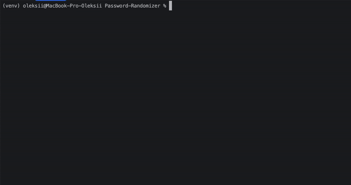

# Password-Randomizer


## Install Requirements
```shell
$ pip install -r requirements.txt
```

## Flags

---
Runs generating password without asks. 
The Password will be generated with all symbols in 15 length symbols.
```shell
$ python3 passgen.py --no-asks
```
---
Automatically save generated Password to clipboard.
```shell
$ python3 passgen.py --clipboard
```